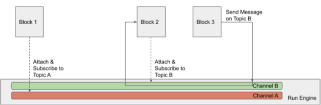

# Angular Message Queue

The goal of the exercise is to implement a light-weight architecture used to dispatch messages across blocks as shown in the following Figure:

Each block is an Angular component that can subscribe to a topic, can send a message, and receive messages based on the topics it is subscribed to. In the above example, Block 2 is subscribed to Topic B. When Block 3 send a message on Topic B, Block 2 should receive the message but not Block 1.

Create an Angular application to implement the above architecture. You will have one day to work on this exercise. We will have a 15-min video conference to look at the solution together.